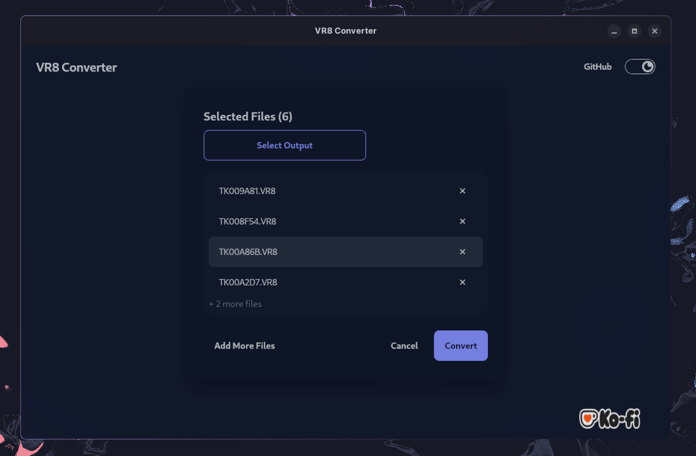
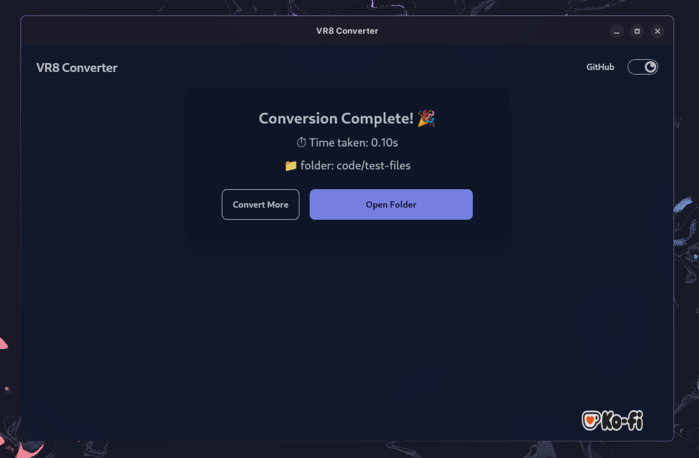

<div align="center">
<h1>VR8 Converter</h1>
<p>convert VR8 to WAV in milliseconds! built in Rust & Tauri</p>
</div>

<div><br></br></div>

<div align="center">
  
  
  
</div>

## ✨ Features

- fast conversion using Rust
- Batch processing support
- Smart memory handling for large files

## 🚀 Setup

installers available for:

- Windows (`exe`, `msi`)
- Linux (`deb`, `rpm`, `appimage`)

> Check out the **Latest Release** and download the installer or **build** from source

> [!NOTE]
> For Arch/AMD users, there's a known issue specificlly with `appimage` binaries. Build from source instead.

## 🔨 Build

Requires:

- Rust (latest stable)
- Node.js --LTS
- pnpm

```bash
git clone https://github.com/bastiangx/vr8-converter
cd vr8-converter
pnpm i
pnpm tauri build
```

The **binaries** can be found in:

- _Windows_: `src-tauri/target/release/vr8-converter.exe`
- _Linux_: `src-tauri/target/release/vr8-converter`

**Installers** will be in:

`../release/bundle/`

- _Windows_: msi/ and nsis/

- _Linux_: appimage/, deb/, rpm/
