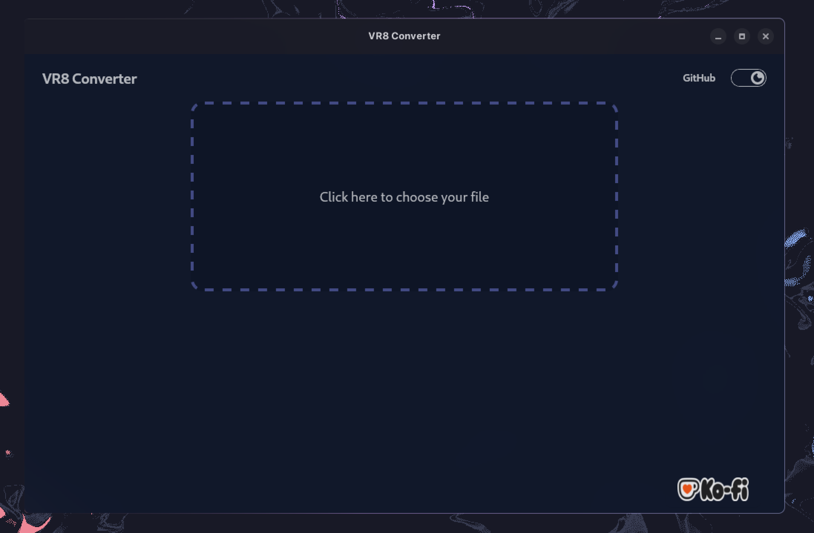

<div align="center">
<h1>VR8 Converter</h1>
<p>convert VR8 to WAV in milliseconds! built in Rust & Tauri</p>
</div>

<br/><br/>

<div align="center">
<a href="#features">✨ Features</a> •
<a href="#install">🚀 Install</a>
<a href="#build">🔨 Build</a>
</div>

<br/><br/>

<div align="center">
  
  
  
</div>

<br/><br/>

<div align="center">✨ Features<a name="features"></a>
</div>

- fast conversion using Rust
- Batch processing support
- Smart memory handling for large files

<br/><br/>

<div align="center">
  <h2>🚀 Setup<a name="install"></a></h2>
</div>

Check out the **Latest Release** and download the installer or <a href="#build">Build</a> from source (Linux)

<br/><br/>

<div align="center">🔨 Build<a name="build"></a>
</div>

Requires:

- Rust (latest stable)
- Node.js --LTS
- pnpm

```bash
git clone https://github.com/bastiangx/vr8-converter
cd vr8-converter
pnpm i
pnpm tauri build
```

The **binaries** can be found in:

- _Windows_: `src-tauri/target/release/vr8-converter.exe`
- _Linux_: `src-tauri/target/release/vr8-converter`

**Installers** will be in:

`../release/bundle/`

_Windows_: msi/ and nsis/
_Linux_: appimage/, deb/, rpm/
